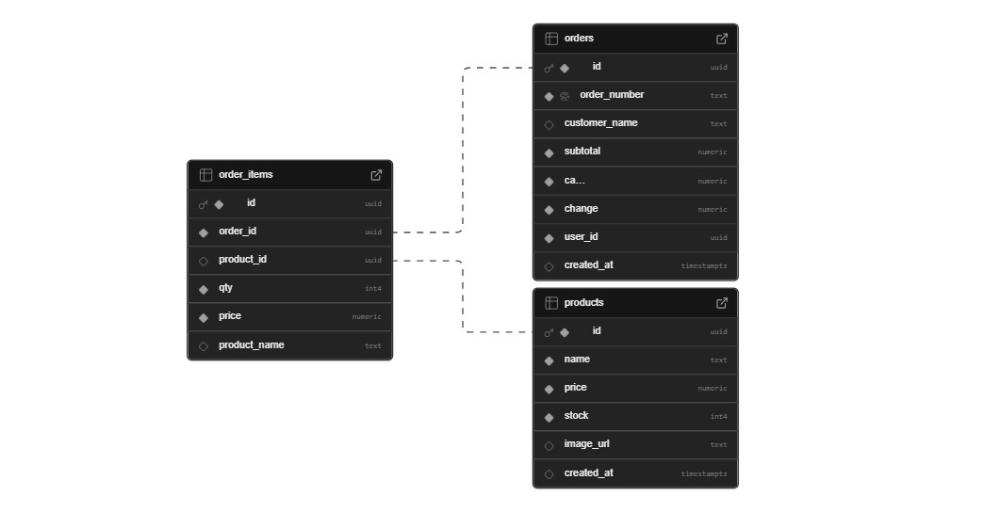
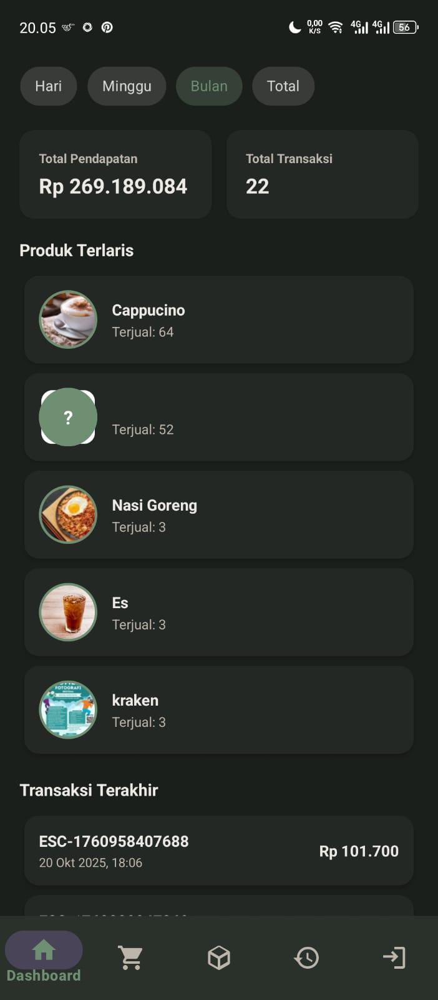

## Database 

## Flowchart

## UI

<table>
  <tr>
    <td></td>
    <td></td>
    <td></td>
    <td></td>
  </tr>
  <tr>
    <td align="center">Dashboard</td>
    <td align="center">Daftar Produk</td>
    <td align="center">Transaksi</td>
    <td align="center">Riwayat</td>
  </tr>
</table>
