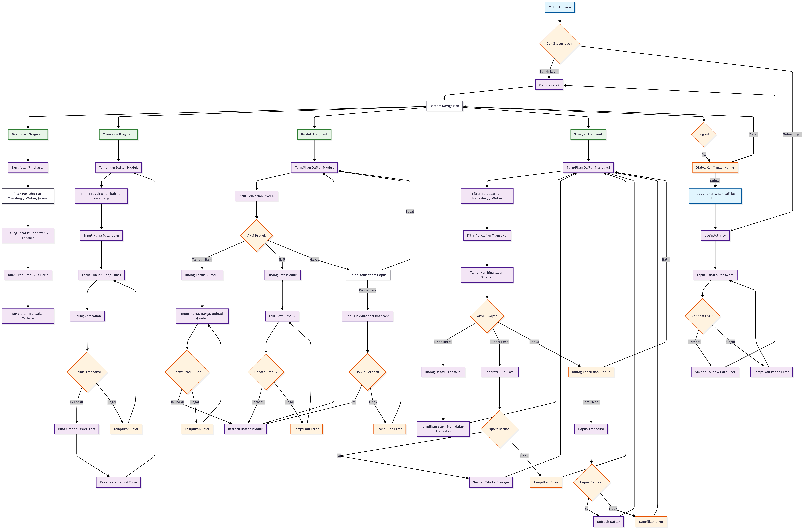

# EssyCoff - Coffee Shop Management Android App

EssyCoff adalah aplikasi manajemen kedai kopi berbasis Android yang memungkinkan pengelolaan produk, transaksi, dan riwayat penjualan dengan mudah dan efisien. Aplikasi ini menggunakan Supabase sebagai backend untuk autentikasi dan penyimpanan data.

## ✨ Features

- **Autentikasi User** - Login/logout dengan Supabase Auth
- **Manajemen Produk** - CRUD operations untuk produk kopi
- **Upload Gambar** - Upload dan kelola gambar produk
- **Sistem Transaksi** - Proses pembelian dengan keranjang
- **Manajemen Stok** - Update stok otomatis setelah transaksi
- **Riwayat Transaksi** - Lihat dan kelola history penjualan
- **Export Data** - Export laporan ke Excel
- **Real-time Updates** - Sinkronisasi data real-time


## 🗄️ Database Schema


## 🔄 Application Flow



### **Alur Aplikasi:**

1. **Login Process**
   - User memasukkan email dan password
   - Validasi kredensial melalui Supabase Auth
   - Simpan token dan user data
   - Redirect ke MainActivity

2. **Main Navigation**
   - Bottom Navigation dengan 4 tab utama
   - ViewPager2 untuk smooth navigation
   - Auto refresh data saat berpindah tab

3. **Product Management**
   - CRUD operations untuk produk
   - Upload gambar ke Supabase Storage
   - Real-time stock management

4. **Transaction Process**
   - Pilih produk dan masukkan ke keranjang
   - Input data pelanggan
   - Kalkulasi otomatis total
   - Simpan order dan order items
   - Update stok produk

5. **History & Reporting**
   - Tampilkan riwayat transaksi
   - Filter dan pencarian
   - Export ke Excel


### **Database Setup**
1. Buat project baru di [Supabase](https://supabase.com)
2. Jalankan SQL berikut untuk membuat tabel:
```sql
-- Products table
CREATE TABLE public.products (
  id uuid NOT NULL DEFAULT gen_random_uuid(),
  name text NOT NULL,
  price numeric NOT NULL,
  stock integer NOT NULL DEFAULT 0,
  image_url text,
  created_at timestamp with time zone DEFAULT now(),
  CONSTRAINT products_pkey PRIMARY KEY (id)
);

-- Orders table
CREATE TABLE public.orders (
  id uuid NOT NULL DEFAULT gen_random_uuid(),
  order_number text NOT NULL UNIQUE,
  customer_name text,
  subtotal numeric NOT NULL DEFAULT 0,
  cash numeric NOT NULL DEFAULT 0,
  change numeric NOT NULL DEFAULT 0,
  user_id uuid NOT NULL,
  created_at timestamp with time zone DEFAULT now(),
  CONSTRAINT orders_pkey PRIMARY KEY (id)
);

-- Order items table
CREATE TABLE public.order_items (
  id uuid NOT NULL DEFAULT gen_random_uuid(),
  order_id uuid NOT NULL,
  product_id uuid,
  qty integer NOT NULL CHECK (qty > 0),
  price numeric NOT NULL,
  product_name text CHECK (product_name IS NULL OR length(TRIM(BOTH FROM product_name)) > 0),
  CONSTRAINT order_items_pkey PRIMARY KEY (id),
  CONSTRAINT order_items_order_id_fkey FOREIGN KEY (order_id) REFERENCES public.orders(id),
  CONSTRAINT order_items_product_id_fkey FOREIGN KEY (product_id) REFERENCES public.products(id)
);
```

## 📱 Installation

### Prerequisites
- Android Studio Arctic Fox atau lebih baru
- Android SDK API level 21 atau lebih tinggi
- Akun Supabase (gratis)

### Setup Project

1. **Clone repository**
   ```bash
   git clone https://github.com/RifqiArdian09/EssyCoffAndroid.git
   cd EssyCoffAndroid
   ```

2. **Setup Supabase**
   - Buat project baru di [Supabase](https://supabase.com)
   - Jalankan SQL schema di atas pada SQL Editor
   - Dapatkan URL dan Anon Key dari Settings > API

3. **Konfigurasi App**
   - Buka file `app/src/main/java/com/example/essycoff/utils/Constants.java`
   - Update URL dan API Key:
   ```java
   public static final String SUPABASE_URL = "YOUR_SUPABASE_URL";
   public static final String SUPABASE_ANON_KEY = "YOUR_SUPABASE_ANON_KEY";
   ```

4. **Build dan Run**
   - Buka project di Android Studio
   - Sync Gradle files
   - Run aplikasi di emulator atau device

## 🚀 Usage

### Login
1. Buka aplikasi
2. Masukkan email dan password
3. Tap "Login" untuk masuk

### Mengelola Produk
1. Pilih tab "Products"
2. Tap "+" untuk menambah produk baru
3. Isi nama, harga, stok, dan upload gambar
4. Tap "Save" untuk menyimpan

### Melakukan Transaksi
1. Pilih tab "Transaction"
2. Pilih produk yang ingin dibeli
3. Atur quantity dan masukkan ke keranjang
4. Isi nama customer dan jumlah bayar
5. Tap "Process Order" untuk menyelesaikan

### Melihat History
1. Pilih tab "History"
2. Lihat daftar transaksi
3. Tap item untuk melihat detail
4. Gunakan fitur search dan filter

